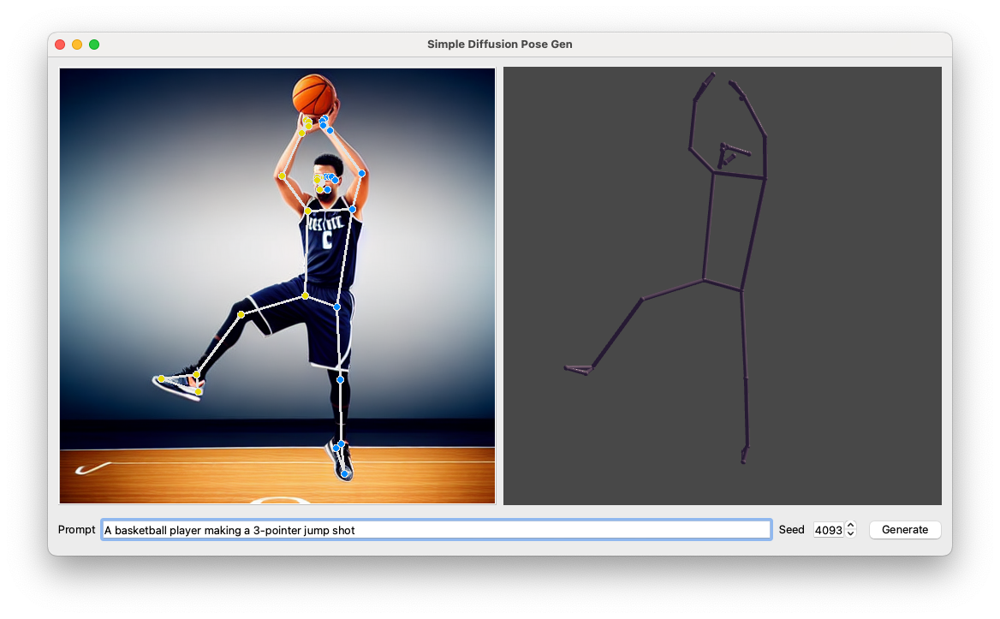
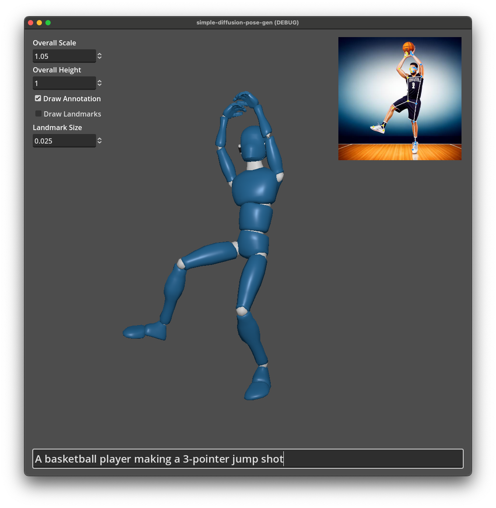
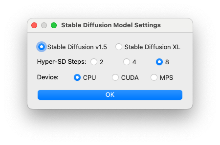

# Simple Diffusion Pose Gen

A quick attempt to utilize [Stable Diffusion](https://huggingface.co/blog/stable_diffusion) (SD) image generative models (v1.5 & XL) and MediaPipe's [Pose Landmarker](https://ai.google.dev/edge/mediapipe/solutions/vision/pose_landmarker) vision models to generate 3D human poses from an AI prompt.

## News

* 2024-11-12: Added a Godot demo with a full-body IK pose solver.
* 2024-10-24: Initial implementation.

## Quickstart

1. Clone repo: `git clone https://github.com/jerenchen/simple-diffusion-pose-gen.git`.
2. Change dir into `python` and (optionally) use a virtual enivronment (e.g. conda).
3. Install Python depedencies: `pip install -r requirements.txt`.
4. Download MediaPipe [Pose Landmarker (Full)](https://storage.googleapis.com/mediapipe-models/pose_landmarker/pose_landmarker_full/float16/latest/pose_landmarker_full.task) and save the file under `python/tasks`.

### Python Standalone Demo

Inside dir `python`, run: `python simple-diffusion-pose-gen.py`, and then enter a prompt to generate a pose.

|  |
| :---: |
| Generating a pose with prompt *"A basketball player making a 3-pointer jump shot"* |

### Godot Full-body IK Pose Gen

1. Inside dir `python`, Initialize the Python pose-gen service: `python posegen.py --base sd15 --steps 8`.
2. Open and run `projec.godot` inside dir `godot` with [Godot Engine](https://godotengine.org/).
3. Enter a prompot to generate a pose.

|  |
| :---: |
|  |

## Stable Diffusion Model Settings

||
|:---:|
|Stable diffusion model settings for the Python standalone demo|

* *Stable Diffusion v1.5* has fewer model parameters and therefore requires less memory whereas *Stable Diffusion XL* could generate images with higher fidelity.
* [Hyper-SD](https://hyper-sd.github.io/) (a SD inference acceleration technique) Steps: *2*, *4*, or *8*, trade-off between speed (fewer bigger steps) and quality (more smaller steps).
* PyTorch device for running SD inference (if available): *CPU*, *CUDA*, or *MPS* (Apple Silicon).

## Acknowledgement

* [Godot + Python Communication with UDP](https://github.com/trflorian/godot-python-comm) by [Florian Trautweiler](https://github.com/trflorian).
* [Open 3D Mannequine](https://github.com/gdquest-demos/godot-3d-mannequin) by [GDQuest](https://github.com/gdquest-demos).